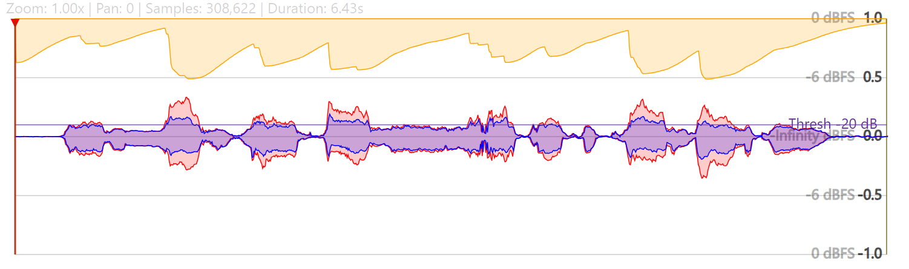

# Compressor visualizer

A simple app to visualize the effect that compressors have on audio.



Check it out on [citelao.github.io/compressor-visualizer/](https://citelao.github.io/compressor-visualizer/).

## Usage

```pwsh
# Initial setup
npm install

# Inner loop
npm run dev
```

This is built with D3 as React components in an Astro host.

### Testing

```pwsh
# Run tests
npm test
npm test -- --run # helpful for Claude; run tests once.

# Clear Vitest cache (if tests fail to run)
npx vitest --clearCache
```

### Deploy

Push to main! GitHub Actions will publish to [citelao.github.io/compressor-visualizer/](https://citelao.github.io/compressor-visualizer/).

## TODO

* [ ] Waveforms should get more detailed when zoomed in; they are currently calculated for the default zoom level and then scale naively.
* [ ] Draggable playhead
* [ ] Custom makeup gain
* [ ] Prettier

## Acknowledgements

* `MS0901_SnareNoComp.wav` is from Campbridge Music Technology's Mixing Secrets Chapter 9: [Compressing for a reason](https://cambridge-mt.com/ms3/ch9/).